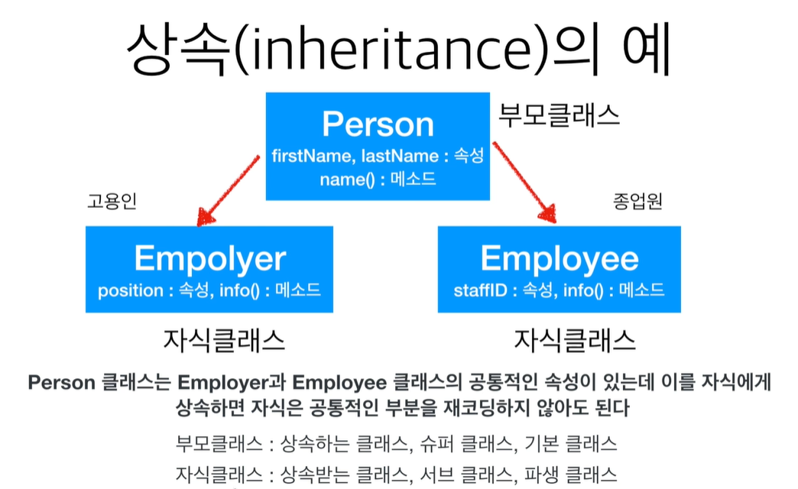

# OOP

### 1. 객체 지향 프로그래밍

> 클래스를 이용해 객체(오브젝트)를 만든다.
>
> 클래스는 속성(인스턴스 변수)과 행위(메소드)를 가지도록 설계하고,
>
> 객체는 클래스에서 정의한 속성과 행위를 수행한다.
>
> 소프트웨어 상에서 객체의 상태 또는 속성은 인스턴스 변수로 표현하고,
>
> 행위 혹은 동작은 메소드로 표현한다.


### 2. Class

#### 2.1 Class 정의

- 클래스 : 속성(attribute)과 행위(method)들을 모아 놓은 집합체. 객체의 설계도(템플릿)

- 인스턴스 : 클래스로부터 만들어지는 각각의 객체. 서로 다른 인스턴스는 서로 다른 속성 값 가짐

  ex) Person -> 클래스

  name, age, skills -> 속성(attribute)

  \__init__(),  walk(), talk(), eat() -> 행위(method)

  - Person 인스턴스는 (name = 'Ju', age = 23, skills = design) 이 될 수도 있고,

    (name = 'Park', age =32, skills = driving) 이 될 수도 있다.

    즉, 각 인스턴스들은 설계도로부터 만들어진 개별적인 객체로, 서로 다른 정보값 가짐


#### 2.2 Class 만들기

- 클래스를 사용하는 이유는 추상화된 현실의 개념을 구체적인 파이썬 코드로 표현하기 위해서.
  ex) 고양이 클래스 -> 인스턴스(색, 이름 등 구체적인 값을 가짐)

  ```python
  # 클래스 정의하기
  class Cat:
  	def meow(self): # meow() 메소드 정의
          print('야옹 야옹')
          
  # 인스턴스 생성과 메소드 호출하기 .(마침표) 연산자 사용
  cat1 = Cat() # Cat 인스턴스 생성. cat1이 이를 참조함
  cat1.meow() # Cat이 구현한 메소드 호출
  ```

  

#### 2.3 인스턴스 변수 생성

```python
class Cat:
    def info(self): # info() 메소드
        # 인스턴스 변수 name과 color 생성
        self.name = '나비'
        self.color = '검정색'
        print(f'고양이 이름은 {self.name}, 색깔은 {self.color}')

cat = Cat() # 인스턴스 생성
cat.info() # 인스턴스 메소드 실행
```


- `self` 파이썬의 self 는 **클래스의 인스턴스를 지칭**하며, self 키워드를 통해 클래스의 메소드와 속성에 접근할 수 있다. 모든  메소드의 첫 번째 매개변수는 자기 자신을 가리키는 self 변수이다. 즉 이 메소드를 호출한 현재 객체를 의미한다.

  ```python
  calss Cat:
      # 초기화 메소드
    def __init__(self, name, color):
          self.name = name
          self.color = colr
      # 고양이 클래스의 정보를 출력하는 메소드
      def info(self):
          print(f'고양이 이름은 {self.name}, 색깔은 {self.color}')
          
  cat1 = Cat('앙꼬', '흰색') # cat1 인스턴스 생성
  cat2 = Cat('양파', '흰색') # cat2 인스턴스 생성
  
  cat1.info()
  cat2.info()
  ```
  


#### 2.4 생성자와 method

- `method` 메소드는 클래스가 가진 함수로 클래스에 묶여서 인스턴스와 관계되는 일을 하는 함수

  ```python
  class Human:
      # 초기화
      def __init__(self, name, age): # 생성자 : 인스턴스 생성시 자동 호출
          self.name = name
          self.age = age
      
      def info(self):
          print(f'이름 : {self.name}, 나이: {self.age}')
          
      def call(self):
          print(f'{self.name}을 호출합니다.')
          
  person = Human('지혜', 25)
  person.info()
  person.call()
  ```

  

#### 2.5 특수 메소드

- 언더바 2개`__method__` 로 묶인 함수

- **초기화 함수** `__init__()` 인스턴스를 만들 때 자동으로 실행되는 메소드

- **문자열화 함수** `__str__()` 인스턴스 자체를 출력할 때의 형식을 지정해주는 메소드로 문자열 객체를 반환. print() 함수가 인스턴스를 출력할 때 (str이라는) 지정된 형식으로 출력됨


#### 2.6 생성자

- 객체를 만들때 인스턴스 변수가 기본값을 가지면 더 좋을 것
- 생성자를 이용해 지정한 초기 상태값을 가진 채로 만들 수 있다.
- `__init__()` 메소드에 초기 상태값을 설정한다. 이 메소드를 다른 말로 생성자
- 생성자 메소드는 객체가 생성될 때 자동으로 호출된다.


```python
class Human:
    def __init__(self, name, age):
        self.name = name
        self.age = age
        
    def __str__(self):
        return f'{self.name} (나이 {self.age}세)'
    
person = Human('지혜', 25)
print(person) # 지혜 (나이 25세)

#__str__() 함수는 print(person) 과 같이 print() 함수의 인자로 객체가 넘어가면 자동으로 호출된다. print(person) = print(person.__str__())
```


#### 2.7 인스턴스 관련 연산자

- `is 연산자` is 연산은 두 인스턴스가 같은 인스턴스인지 검사

- `== 연산자` == 연산은 두 인스턴스의 데이터 값이 같은지 확인

  ```python
  list1 = [1, 2, 3]
  list2 = [1, 2, 3] 
  
  if list1 is list2:
      print('list1과 list1은 같은 인스턴스입니다.')
      
  if list1 == list2:
      print('list1, list2 의 데이터 값은 동일하며')
      if list1 is list2:
          print('list1 과 list2 는 같은 인스턴스입니다.')
      else:
          print('하지만 list1 과 list2 는 다른 인스턴스입니다.')
          
          
  # list1과 list1은 같은 인스턴스입니다.
  # list1, list2 의 데이터 값은 동일하며
  # 하지만 list1 과 list2 는 다른 인스턴스입니다.
  ```


### 3. 상속

우리는 예전에 만들어진 코드를 이용하여 새로운 기능을 개발하는 경우가 많다.

클래스의 상속 기능을 사용하면 부모 클래스에서 만들어둔 기능과 속성을 물려받을 수 있다.

상속은 객체지향 프로그래밍의 매우 뛰어난 기능이다.

새 클래스를 정의할 때 기존의 클래스를 사용한다.




#### 3.1 상속의 문법

```python
class Person:
    def __init__(self, firstname, lastname):
        self.firstname = firstname
        self.lastname = lastname
    
    def name(self):
        return self.firstname + ' ' + self.lastname
    
class Employee(Person):
    def __init__(self, firstname, lastname, staffId):
        Person.__init__(self, firstname, lastname)
        self.staffId = staffId
        
    def info(self):
        return 'Employee :' + self.name() + ',' + str(self.staffId)
    
class Employer(Person):
    def __init__(self, firstname, lastname, position):
        # Person 의 __init__ 을 가지고 온다.
        Person.__init__(self, firstname, lastname)
        # position 이라는 속성 추가
        self.position = position
    
    def info(self):
        return f'Employer :{self.name()},{self.position}'
    
worker = Employee('지혜', '이', 12341234)
developer= Employer('원재', '노', 'developer')

print(worker.info()) # Employee :지혜 이,12341234
print(develope.info()) # Employee :원재 노,developer

```


#### 3.2 super()

- 부모 클래스의 이름을 알고 있을 경우 Person.\__init__ 과 같이 부모 클래스의 이름과 .을 사용하여 부모클래스의 메소드를 호출할 수 있다. 하지만 super() 를 통해 부모 클래스의 메소드를 손쉽게 이용할 수 있으며, 부모 클래스를 명시적으로 적어줄 필요가 없어 프로그램의 유지보수가 쉽다.

`Person.__init__(self, firstname, lastname)` -> `super().__init__(firstname, lastname)` 

super() 가 메소드를 호출할 때는 self 를 자동으로 바운딩하는 메소드에 전달해주므로 self 를 사용할 필요가 없다.